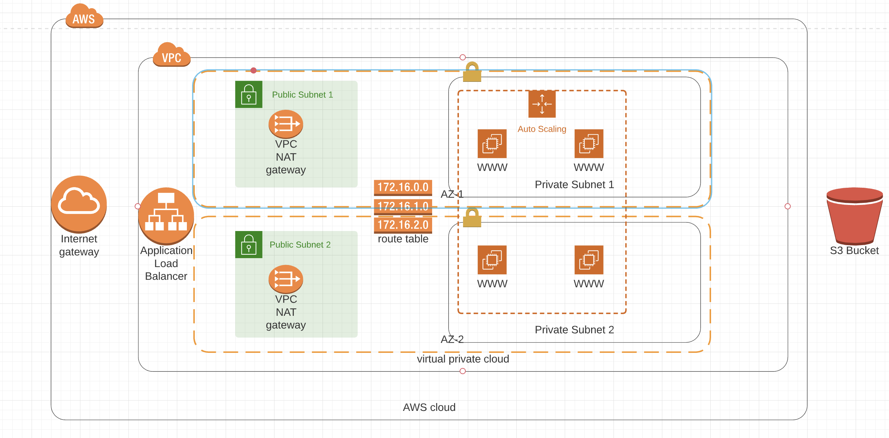

# Deploy a highly available web application using CloudFormation

In this project, we will be deploying we servers for a highly available web app using CloudFormation.

## Architecture Diagram



 Creating this project will give you the hands-on experience you need to confidently talk about infrastructure as code. So, for that reason, we have chosen a realistic scenario where you deploy an application (Apache Web Server) and you also pick up code (JavaScript and HTML) from S3 Storage and deploy it in the appropriate folder on the web server. 

## Resources
- VPC: A virtual private cloud is an on-demand configurable pool of shared computing resources allocated within a public cloud environment, providing a certain level of isolation between the different organizations using the resources.

- InternetGateway: An Internet gateway is a horizontally scaled, redundant, and highly available VPC component that allows communication between instances in your VPC and the Internet.

- VPC Gateway Attachment: Attaches an internet gateway, or a virtual private gateway to a VPC, enabling connectivity between the internet and the VPC.

- Subnet: A subnetwork or subnet is a logical subdivision of an IP network. The practice of dividing a network into two or more networks is called subnetting.

- Elastic IP: Specifies an Elastic IP (EIP) address and can, optionally, associate it with an Amazon EC2 instance.

- NatGateway: NAT Gateway is a highly available AWS managed service that makes it easy to connect to the Internet from instances within a private subnet in an Amazon Virtual Private Cloud (Amazon VPC).

- RouteTable: A route table contains a set of rules, called routes, that are used to determine where network traffic from your subnet or gateway is directed.

- Route: Specifies a route in a route table within a VPC.

- SubnetRouteTableAssociation: Associates a subnet with a route table. The subnet and route table must be in the same VPC. This association causes traffic originating from the subnet to be routed according to the routes in the route table. A route table can be associated with multiple subnets.

- IAM Role: An IAM role is an IAM identity that you can create in your account that has specific permissions. An IAM role is similar to an IAM user, in that it is an AWS identity with permission policies that determine what the identity can and cannot do in AWS. However, instead of being uniquely associated with one person, a role is intended to be assumable by anyone who needs it.

- InstanceProfile: Use an instance profile to pass an IAM role to an EC2 instance. An instance profile can contain only one IAM role, although a role can be included in multiple instance profiles. This limit of one role per instance profile cannot be increased.

- SecurityGroup: A security group acts as a virtual firewall for your instance to control inbound and outbound traffic. When you launch an instance in a VPC, you can assign up to five security groups to the instance. Security groups act at the instance level, not the subnet level. Therefore, each instance in a subnet in your VPC can be assigned to a different set of security groups.

- LaunchConfiguration: A launch configuration is an instance configuration template that an Auto Scaling group uses to launch EC2 instances. When you create a launch configuration, you specify information for the instances. Include the ID of the Amazon Machine Image (AMI), the instance type, a key pair, one or more security groups, and a block device mapping.

- ElasticLoadBalancing TargetGroup: A target group tells a load balancer where to direct traffic to : EC2 instances, fixed IP addresses; or AWS Lambda functions, amongst others. When creating a load balancer, you create one or more listeners and configure listener rules to direct the traffic to one target group.

- LoadBalancer: Elastic Load Balancing automatically distributes incoming application traffic across multiple targets, such as Amazon EC2 instances, containers, IP addresses, and Lambda functions. It can handle the varying load of your application traffic in a single Availability Zone or across multiple Availability Zones.

- Listener: Before you start using Elastic Load Balancing, you must configure one or more listeners for your Classic Load Balancer. A listener is a process that checks for connection requests. It is configured with a protocol and a port for front-end (client to load balancer) connections, and a protocol and a port for back-end (load balancer to back-end instance) connections. supports the following protocols: HTTP, HTTPS, TCP, SSL.

- ListenerRule: Specifies a listener rule. The listener must be associated with an Application Load Balancer. Each rule consists of a priority, one or more actions, and one or more conditions.

## Setup

* Networking: Create the network by running:

```
./create.sh udagram-network udagram-infrastructure-network.yaml udagram-infrastructure-network-parameters.json
```

* Servers: Create teh servers by running:

```
./create.sh udagram-servers udagram-infrastructure-server.yaml udagram-infrastructure-server-parameters.json
```

* Delete: Delete the stack by running:

```
./delete.sh udagram-servers
```
```
./delete.sh udagram-network
```

## URL
```
http://udagr-WebAp-XAIOM2XE9PMG-224008081.us-west-2.elb.amazonaws.com
```